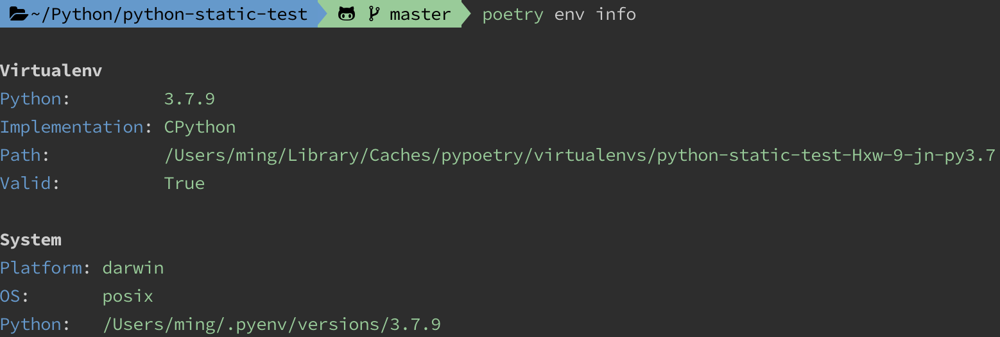
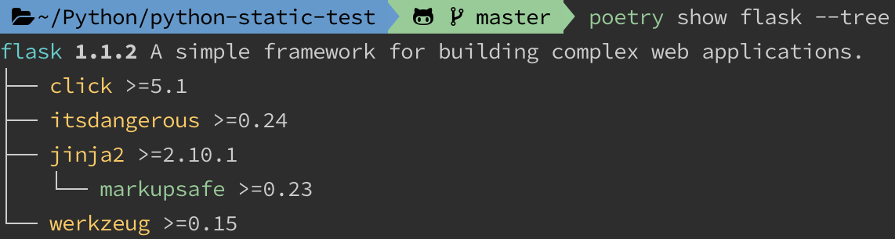
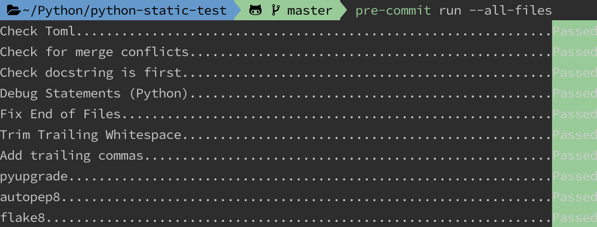
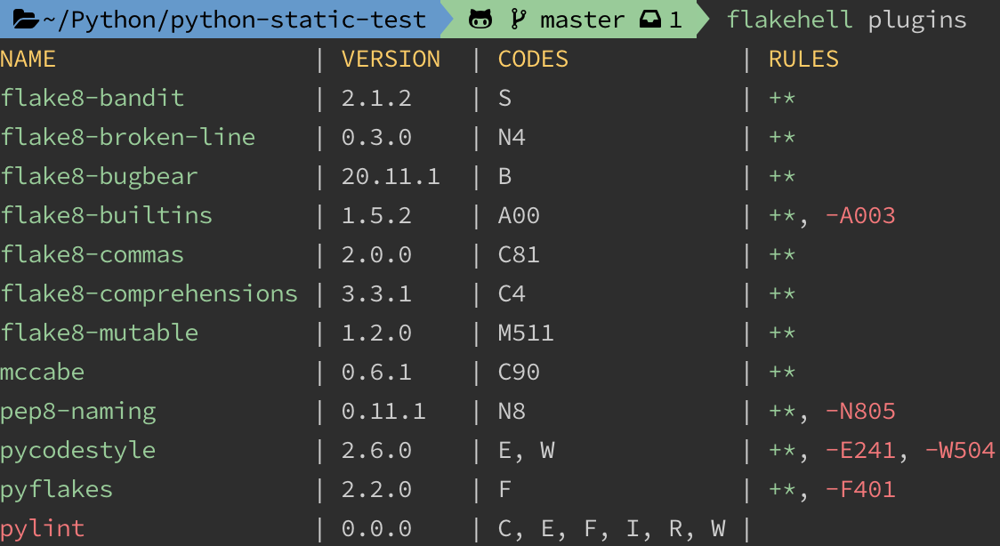
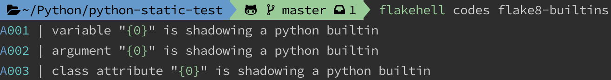

# Python Static Test

### About


The simple template to prepare static tests on a Python project.


### Project setup

1. [Install a macOS packages management - brew](https://brew.sh/)

1. [Install a Python version management - pyenv](https://github.com/pyenv/pyenv)

1. [Install a dependency management - poetry](https://python-poetry.org/docs/)

1. Create a virtual environment

   ```bash
   poetry env use python3.7
   poetry env list
   poetry env info
   ```

   

1. Inspect Python packages

   ```bash
   poetry show
   poetry show --tree
   poetry show <package> --tree
   ```

   

1. Install Python packages

   ```bash
   poetry install
   poetry install -E unit-test
   poetry install -E static-test

   poetry shell
   pre-commit install
   pre-commit run --all-files  # git hook scripts
   ```

   


### Code Linter

We use [Flake8](https://flake8.pycqa.org/en/latest/) and [FlakeHell](https://flakehell.readthedocs.io/index.html) to
perform static analysis of source code checking for symantec discrepancies to follow the coding standards.

- [Flake8 Extensions](https://github.com/DmytroLitvinov/awesome-flake8-extensions)

- [Flake8 Rules](https://lintlyci.github.io/Flake8Rules/)

- [Bandit Rules](https://bandit.readthedocs.io/en/latest/plugins/index.html#complete-test-plugin-listing)

1. Config in [pyproject.toml](pyproject.toml)

   ```toml
   [tool.flakehell]
   plugins-rule = "..."

   [tool.flakehell.plugins]
   package-name = ["+*", "..."]
   ```

1. Inspect Flake8 plugins

   ```shell
   flakehell plugins
   flakehell codes <package-name>
   ```

   
   

1. Run patched flake8 against the code

   ```shell
   flakehell lint
   ```

   
